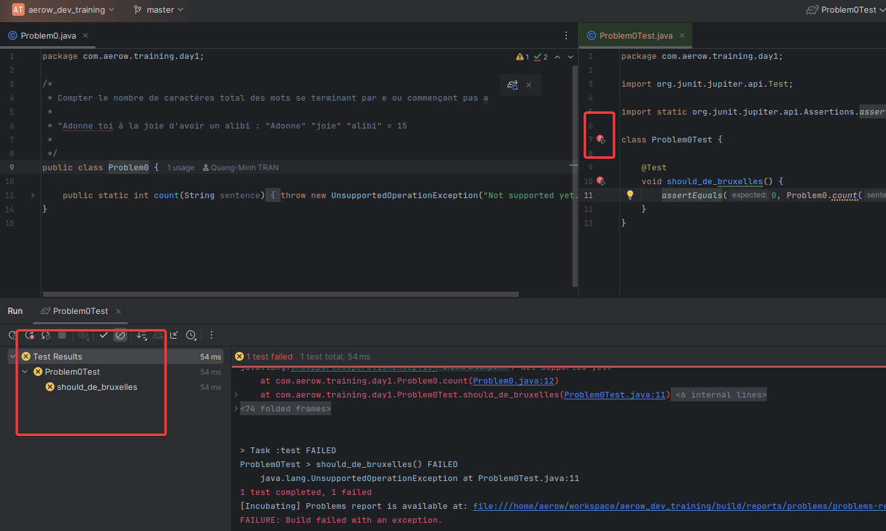

# aerow_dev_training

Le projet comme support de formation pour s'améliorer au développement par trois axes : 
- le tdd (Test Driven Development) : ou comment aller au cinéma voir son algorithme se dessiner
- la programmation fonction : ou comment changer de paradigme
- la clean architecture : ou comment être un petit chef et laisser les autres s'adapter à toi

## Prérequis

- Avoir installé [java 24](https://jdk.java.net/24/)
- Posséder un IDE par exemple [Intellij](https://www.jetbrains.com/idea/download). Il est recommandé de prendre un IDE
que vous maîtrisez
- Avoir des bases en Java (c'est plus sympa pour apprendre)
- Posséder git pour cloner le projet

## Pour compiler

```bash
# cloner ce projet
git clone https://github.com/Minhounet/aerow.git
# Compiler le 
./gradlew clean build # sans "clean" est possible aussi si on veut gagner en rapidité
```

## Pour tester à tout moment

Bien que vous puissiez utiliser la commande **Gradle** ci-dessus, vous pouvez tout simplement utiliser votre éditeur pour
notamment exécuter les tests unitaires très rapidement.



## Les exercices

### TDD

Voir les classes ci-dessous :
- [Problem0.java](src/main/java/com/aerow/training/day1/Problem0.java)
- [Problem1.java](src/main/java/com/aerow/training/day1/Problem1.java)
- [Problem2.java](src/main/java/com/aerow/training/day1/Problem2.java)
- [Problem3Legacy.java](src/main/java/com/aerow/training/day1/Problem3Legacy.java)

### Programmation fonctionnelle

Voir les classes ci-dessous :
- [Problem4.java](src/main/java/com/aerow/training/day1/Problem4.java)
- [Problem5.java](src/main/java/com/aerow/training/day1/Problem5.java)
- [Problem6.java](src/main/java/com/aerow/training/day1/Problem6.java)
- [Problem7.java](src/main/java/com/aerow/training/day1/Problem7.java)

### vavr

La super bibliothèque fonctionnelle, voir [Problem8.java](src/main/java/com/aerow/training/day1/Problem8.java)

### Pour voir les solutions

Il y a un moyen d'accéder à certaines solutions mais cela sera incrémental:

```bash
git switch Problem1 # permet d'accéder à la solution du problème 1
git switch Problem2 # permet d'accéder à la solution du problème 2 et du problème 1 etc...

git branch -av # voir toutes les branches (et ainsi toutes les solutions)

git switch solution # pour tout avoir, cette branche bouge régulièrement, ne soyez pas surpris
```

## Auteur

Quang-Minh TRAN (Aerow)
